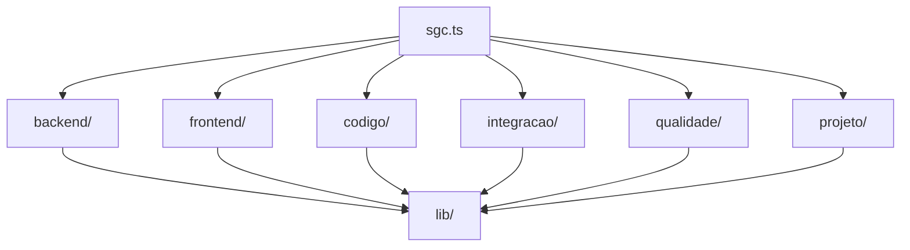

# Toolkit de Scripts do SGC

## Papel do módulo

`toolkit/` reúne a CLI de automação do repositório. Ela concentra comandos operacionais e de auditoria usados para
qualidade, preparação, diagnóstico do projeto e utilidades de backend/frontend.

### Execução e build

O toolkit executa a árvore-fonte diretamente. O build é uma verificação opcional do artefato compilado e não faz parte do
fluxo normal de desenvolvimento:

```bash
npm --prefix toolkit run build
```

Ponto de entrada principal:

```bash
npx tsx toolkit/sgc.ts
```

Quando um comando importar módulos TypeScript, o toolkit usa `tsx` automaticamente. Também é possível executar um
script diretamente:

```bash
npx tsx toolkit/sgc.ts --help
npx tsx toolkit/projeto/arvore-linhas.ts --help
```

## Visão arquitetural

O toolkit é um módulo Node.js em ESM, separado do backend/frontend, com dependências próprias e testes próprios.


```mermaid
graph TD
    CLI[sgc.ts] --> Backend[backend/]
    CLI --> Frontend[frontend/]
    CLI --> Codigo[codigo/]
    CLI --> Integracao[integracao/]
    CLI --> Qualidade[qualidade/]
    CLI --> Projeto[projeto/]
    Backend --> Lib[lib/]
    Frontend --> Lib
    Codigo --> Lib
    Integracao --> Lib
    Qualidade --> Lib
    Projeto --> Lib
```

## Estrutura do diretório

| Caminho       | Papel                                                             |
|---------------|-------------------------------------------------------------------|
| `sgc.ts`      | roteador principal da CLI                                         |
| `lib/`        | catálogo de comandos, infraestrutura compartilhada, execução, caminhos, saída e utilidades |
| `backend/`    | comandos de cobertura, testes e higiene Java                      |
| `frontend/`   | comandos de cobertura, resíduos, validações e acessibilidade     |
| `codigo/`     | auditorias transversais de cheiros de código                       |
| `integracao/` | contratos OpenAPI e fronteira backend/frontend                    |
| `qualidade/`  | coleta e resumo de qualidade                                       |
| `projeto/`    | preparação, diagnóstico, limpeza e qualidade do repositório        |
| `test/`       | testes do toolkit                                                 |

## Exemplos de comandos por domínio

O catálogo canônico de comandos e descrições é a própria ajuda da CLI; consulte-a antes de procurar um comando:

```bash
npx tsx toolkit/sgc.ts --help
npx tsx toolkit/sgc.ts backend --help
npx tsx toolkit/sgc.ts frontend --help
```

Os exemplos abaixo são intencionalmente representativos. A lista completa não é repetida nesta documentação para evitar
que o roteador e o README se tornem duas fontes de verdade.

### Backend

```bash
npx tsx toolkit/sgc.ts backend cobertura auditoria
npx tsx toolkit/sgc.ts backend testes analisar
npx tsx toolkit/sgc.ts backend testes priorizar
npx tsx toolkit/sgc.ts backend java corrigir-fqn --gravar
npx tsx toolkit/sgc.ts backend notificacoes auditar-assuntos
```

`backend java corrigir-fqn` apenas lista as substituições por padrão; use `--gravar` para alterar os arquivos Java. Com
`configuracao-toolkit.json`, ele usa `diretorios.backendCodigo` e `diretorios.backendTestes`; sem configuração, conserva
a descoberta tradicional de `src/main/java` e `src/test/java`.

`backend testes analisar` gera `analise-testes.md` e `analise-testes.json` por padrão; `backend testes priorizar` consome
esse sidecar e grava `priorizacao-testes.md` por padrão.

Em `backend testes analisar`, `--diretorio` pode ser absoluto ou relativo a `--base`; quando omitido, os diretórios
configurados `backendCodigo` e `backendTestes` são usados.

### Frontend

```bash
npx tsx toolkit/sgc.ts frontend cobertura auditoria
npx tsx toolkit/sgc.ts frontend residuos auditar
npx tsx toolkit/sgc.ts frontend residuos validar
npx tsx toolkit/sgc.ts frontend identificadores-teste listar
npx tsx toolkit/sgc.ts frontend identificadores-teste listar-duplicados
npx tsx toolkit/sgc.ts frontend acessibilidade crawler
npx tsx toolkit/sgc.ts frontend acessibilidade processar
```

### Código transversal

```bash
npx tsx toolkit/sgc.ts codigo cheiros auditar
npx tsx toolkit/sgc.ts codigo semgrep auditar
npx tsx toolkit/sgc.ts codigo nomes coletar-simbolos
npx tsx toolkit/sgc.ts codigo nomes auditar-consistencia
```

As auditorias de cheiros são somente leitura por padrão e emitem a fotografia em JSON no stdout. Para atualizar os
artefatos `fotografia.json` e `resumo.md`, use a ação explícita `--gravar`:

```bash
npx tsx toolkit/sgc.ts codigo cheiros auditar --json
npx tsx toolkit/sgc.ts codigo cheiros auditar --gravar
```

`frontend arquitetura auditar` segue a mesma regra: a fotografia sai no stdout sem gravação; use `--gravar` para
persistir os artefatos. O coletor consolidado de qualidade já informa essa opção quando precisa manter o artefato
intermediário do perfil SGC.

`backend arquitetura auditar` também é somente leitura por padrão. Use `--gravar` para atualizar os relatórios
Markdown e JSON no diretório de artefatos configurado.

`backend coesao auditar` segue o mesmo contrato e só grava os relatórios quando recebe `--gravar`.

`backend contratos auditar` também é somente leitura por padrão; `--gravar` persiste o relatório Markdown sem alterar
o código Java.

`frontend residuos auditar` e `frontend residuos validar` seguem o mesmo contrato. A fotografia, o resumo e a fotografia
mais recente da validação só são atualizados com `--gravar`; sem essa opção, os resultados ficam no stdout.

`codigo semgrep auditar` também só grava `resultado.json` e `resumo.md` com `--gravar`; a política padrão continua
vindo do pacote e políticas locais podem ser informadas por `--regra` ou pela configuração.

Os caminhos dos achados Semgrep são normalizados em relação a `--base`, independentemente de a ferramenta externa
retornar caminhos relativos ou absolutos.

`codigo nomes coletar-simbolos`, `codigo nomes auditar-consistencia` e `codigo nomes auditar-idioma` também são
somente leitura por padrão. Use `--gravar` para persistir o inventário ou os relatórios de nomenclatura; quando uma
auditoria precisar criar o inventário auxiliar, a mesma opção é propagada explicitamente para essa coleta interna.

`integracao contratos diff` compara os documentos OpenAPI sem gravar por padrão. Use `--gravar` para persistir o resumo
Markdown; `exportar-openapi` e `fixar-baseline` continuam sendo ações de geração/promoção explícitas.

`backend cobertura auditoria` e `frontend cobertura auditoria` também só persistem o relatório Markdown com `--gravar`.
O modo `--json` continua adequado para integração sem criar arquivos. Use `--minimo <percentual>` para transformar
cobertura abaixo da meta em código de saída de falha.

### Requisitos

```bash
npx tsx toolkit/sgc.ts requisitos cdus inventariar
npx tsx toolkit/sgc.ts requisitos cdus auditar
npx tsx toolkit/sgc.ts requisitos cdus auditar-estilo
npx tsx toolkit/sgc.ts requisitos cdus inventariar-vocabulario
npx tsx toolkit/sgc.ts requisitos cdus auditar-vocabulario
npx tsx toolkit/sgc.ts requisitos cdus inventariar-mensagens
npx tsx toolkit/sgc.ts requisitos cdus auditar-mensagens
npx tsx toolkit/sgc.ts requisitos cdus auditar-mensagens-codigo
npx tsx toolkit/sgc.ts requisitos cdus inventariar-densidade
npx tsx toolkit/sgc.ts requisitos cdus inventariar-duplicacoes
```

### Qualidade

```bash
npx tsx toolkit/sgc.ts qualidade coletar --perfil rapido
npx tsx toolkit/sgc.ts qualidade resumo
npx tsx toolkit/sgc.ts qualidade resumo --limite-pontos-criticos 10
```

`qualidade resumo --base <diretorio>` informa o caminho da fotografia relativo à base auditada, inclusive quando a
fotografia é encontrada em `artefatosQualidade/mais-recente`.

### Projeto

```bash
npx tsx toolkit/sgc.ts projeto diagnostico
npx tsx toolkit/sgc.ts projeto dependencias auditar
npx tsx toolkit/sgc.ts projeto limpar --confirmar
npx tsx toolkit/sgc.ts projeto qualidade rapido
npx tsx toolkit/sgc.ts projeto preparar --instalar-dependencias
npx tsx toolkit/sgc.ts projeto arvore-linhas
npx tsx toolkit/sgc.ts projeto versao-sincronizar 1.2.3 --gravar
```

`projeto arvore-linhas` usa as opções `--profundidade`, `--minimo-linhas`, `--excluir-testes` e `--base`. O filtro
de testes reconhece padrões comuns de JavaScript, Vue, Playwright e Java, incluindo qualquer caminho `src/test`.

`projeto versao-sincronizar` apenas simula por padrão. Use `--base` para outra raiz e `--gravar` para atualizar
`gradle.properties` e o `package.json` do diretório definido por `diretorios.frontend` em
`configuracao-toolkit.json` (o padrão do SGC é `frontend`).

`projeto limpar` mantém a prévia por padrão, resolve `diretorios.backend`, `diretorios.frontend` e
`diretorios.artefatosQualidade` da configuração da base e não inclui nomes de relatórios legados removidos.

`projeto diagnostico` resolve os arquivos de backend, frontend e integração pelos diretórios configurados. Em uma base
externa, não exige arquivos do próprio toolkit nem as portas e o `.env.e2e` específicos do SGC; esses recursos voltam a
ser verificados quando a base contém `toolkit/sgc.ts`. Catálogos adicionais continuam disponíveis pela API
`executarDiagnostico`.

## Casos de uso típicos

- gerar fotografia consolidada de qualidade para revisão técnica;
- auditar residuos e duplicidade no frontend;
- apoiar evolução da suíte de testes backend;
- validar divergência entre Bean Validation e validação de UI;
- preparar ambiente local de desenvolvimento;
- produzir artefatos de qualidade para inspeção manual.

Os artefatos gerados ficam em `toolkit/qualidade/artefatos/` e são organizados por execução e fotografia mais recente.

### Contrato OpenAPI

O Springdoc continua no backend porque o ciclo E2E usa a documentação OpenAPI/Swagger para aguardar a aplicação nos
ambientes `e2e` e `hom`. No toolkit, a integração mantém exportação, comparação e fixação de referência do contrato.
O gerador de tipos TypeScript foi removido enquanto não houver consumidor de tipos gerados no frontend e enquanto a
ferramenta de geração exigir uma versão anterior do TypeScript.

## Configuração e migração para TypeScript

Os diretórios variáveis do projeto podem ser sobrescritos em `configuracao-toolkit.json` na raiz. Os valores padrão
cobrem o layout atual do SGC, enquanto a configuração permite reutilizar o toolkit em outros projetos sem editar os
auditores.

O arquivo exige a versão `1` e aceita uma seção `diretorios` com nomes conhecidos pelo toolkit:

```json
{
  "versao": 1,
  "diretorios": {
    "backendCodigo": "backend/src/main/java",
    "backendTestes": "backend/src/test/java",
    "frontendCodigo": "frontend/src",
    "testesIntegracao": "e2e",
    "artefatosQualidade": "toolkit/qualidade/artefatos"
  }
}
```

Chaves desconhecidas, versões não suportadas e caminhos vazios falham na borda de configuração, antes de um auditor
iniciar.
O contrato TypeScript também restringe os nomes de diretório ao mesmo conjunto aceito pelo schema; componentes que
resolvem caminhos recebem uma chave conhecida, reduzindo typos antes da execução.

Além dos diretórios, um projeto pode declarar as execuções que substituem os catálogos padrão do perfil SGC. A seção
`execucoes` aceita escopos de auditoria de dependências, escopos de instalação e perfis de qualidade. Cada comando é
executado na base do projeto ou no segmento informado; `argumentos` deve ser sempre uma lista de textos:

```json
{
  "versao": 1,
  "execucoes": {
    "dependencias": [
      {
        "titulo": "Auditar cliente",
        "segmento": "cliente",
        "comando": "npm",
        "argumentos": ["run", "auditar-dependencias"]
      }
    ],
    "qualidade": {
      "rapido": {
        "descricao": "Verificações rápidas do projeto",
        "tarefas": [
          {
            "titulo": "Verificar projeto",
            "comando": "npm",
            "argumentos": ["run", "qualidade"]
          }
        ]
      }
    },
    "instalacao": [
      {"titulo": "Instalar cliente", "segmento": "cliente"}
    ]
  }
}
```

As três listas são independentes: uma configuração que declara somente um perfil de qualidade continua usando os
defaults SGC para dependências e instalação. Opções explícitas da API ou da CLI têm precedência sobre a configuração;
quando nenhuma delas existe, os defaults SGC preservam o comportamento atual. Os comandos são configuração confiável
do projeto e não formam uma camada de segurança ou de sandbox.

O comando `frontend acessibilidade crawler` deriva a especificação `a11y/crawler.spec.ts` e a configuração
`playwright.config.ts` do diretório definido por `diretorios.testesIntegracao`. Projetos com outra estrutura podem usar
`--especificacao` e `--configuracao` explicitamente.

Os orçamentos e exceções de resíduos frontend não têm política padrão empacotada. Sem `diretorios.orcamentoResiduosFrontend`
ou `diretorios.excecoesResiduosFrontend`, o toolkit usa uma política neutra identificada como `padrao-do-toolkit`. Ao
declarar um desses caminhos, o arquivo passa a ser obrigatório e precisa conter JSON válido; arquivo ausente ou inválido
interrompe a validação.

A regra Semgrep padrão é a política do perfil SGC fornecida pelo próprio pacote. Em outro projeto, informe
`diretorios.regrasSemgrep` para usar uma política local; o toolkit resolve o override relativo à raiz auditada.

Nos comandos de inspeção de frontend, `--base` representa a raiz do projeto e resolve `frontendCodigo`; use `--diretorio`
quando a intenção for apontar diretamente para outro diretório de código.

Nos comandos frontend que geram fotografias ou relatórios, caminhos relativos de `--saida`, `--orcamento` e `--excecoes`
também são resolvidos contra `--base`; os caminhos exibidos no resumo permanecem relativos à base auditada.

O toolkit executa a árvore-fonte com `tsx`; toda a implementação e todos os testes estão em TypeScript estrito. Os
testes não participam da implementação distribuída.

Os comandos de requisitos/CDUs e de contratos OpenAPI são módulos importáveis: só executam quando chamados diretamente
pela CLI. Isso permite reutilizar suas funções `principal(argumentos)` em outras automações sem iniciar auditorias ou
integrações durante o carregamento.
`npm run typecheck` executa `tsconfig.estrito.json` com `strict` e `noImplicitOverride` sobre todos os módulos de
implementação TypeScript. `npm run typecheck:testes` aplica o mesmo rigor aos vinte e seis arquivos de teste TypeScript;
a divisão por domínio segue reduzindo o teste principal sem manter testes JavaScript ou uma migração parcial de linguagem.

Os comandos de projeto seguem a mesma fronteira. A árvore de linhas aceita `--base <diretorio>` para analisar outro
repositório Git, e a sincronização de versão aceita um diretório base nas funções reutilizáveis sem alterar o projeto
atual por padrão.

Na camada de qualidade, `coleta.ts` e `resumo.ts` têm fronteira reutilizável e não executam trabalho durante o `import`.
`coleta-adaptadores-sgc.ts` mantém os adaptadores Gradle, npm, Playwright e os auditores locais específicos do SGC como
defaults da CLI; `coleta-executor.ts` concentra subprocessos, `coleta-leitores.ts` concentra leitura de JSON/JUnit e
validação de hotspots, `coleta-fotografia.ts` concentra o contrato e a persistência da fotografia,
`coleta-contexto.ts` concentra a fábrica de contexto SGC substituível, e `coleta-execucao.ts` concentra agregação e
orquestração; `coleta-metadados.ts` mantém a coleta Git como default substituível, e a versão do schema da fotografia
fica centralizada no próprio módulo. Os formatos JSON específicos de resíduos, arquitetura e Playwright ficam nos
adaptadores SGC, não no núcleo. A função
`principal(argumentos, {perfis, adaptadores, criarContexto, coletarMetadados, persistirFotografia})` aceita catálogos e
serviços externos por composição, sem mutar os defaults globais;
essa é a fronteira de composição reutilizável atualmente. O perfil SGC continua sendo o default da CLI, mas um consumidor
externo pode fornecer seus próprios perfis, adaptadores, contexto, metadados e persistência. Mesmo no perfil SGC, a
montagem dos argumentos Playwright usa `diretorios.testesIntegracao`, a mesma convenção do crawler de acessibilidade.

Os comandos `codigo nomes` também resolvem `simbolos.json`, `consistencia.json` e `idioma.json` relativos ao `--base`
informado. Assim, a auditoria de outro projeto não lê nem grava silenciosamente no diretório de artefatos do SGC.

Os comandos `backend cobertura auditoria` e `backend cobertura ramificacoes` aceitam `--base` e `--arquivo` para
reutilizar relatórios JaCoCo de outro projeto Spring/Gradle. A antiga auditoria cruzada manual foi removida da CLI por
duplicar a leitura do XML sem contrato JSON ou testes próprios; o histórico Git preserva sua implementação.

## Dependências e execução

`toolkit/package.json` define dependências próprias, separadas do restante do repositório.

Instalação:

```bash
npm --prefix toolkit install
```

Execução dos testes do toolkit:

```bash
npm --prefix toolkit run test
```

Para medir a cobertura do próprio toolkit sem impor threshold prematuro:

```bash
npm --prefix toolkit run test:coverage
```

O relatório exclui `test/**` para medir somente a implementação distribuível, sem contar o apoio ou os próprios testes.

O smoke de distribuição instala o tarball em um consumidor temporário, sem usar dependências hoisted do monorepo:

```bash
npm --prefix toolkit run test:pacote
```

O modelo de distribuição é fonte + `tsx`. Para consumir uma versão empacotada em outro projeto, instale o tarball e
execute o binário pelo `npx`:

```bash
npm install --save-dev ./sgc-scripts-0.1.0.tgz
npx sgc --help
```

As primitivas horizontais de leitura de cobertura também podem ser consumidas programaticamente. Elas recebem a base e
o arquivo explicitamente, portanto não dependem do layout do SGC:

```ts
import {extrairCoberturaJacoco} from "sgc-scripts/cobertura-java";
import {extrairCoberturaFrontend} from "sgc-scripts/cobertura-web";

const jacoco = await extrairCoberturaJacoco("relatorios/jacoco.xml", {diretorioBase});
const frontend = await extrairCoberturaFrontend("cliente/coverage/coverage-final.json", {diretorioBase});
```

Os subpaths públicos são deliberados; módulos internos em `lib/` não fazem parte da API programática. Os formatos
externos continuam com os nomes próprios do JaCoCo e do V8, enquanto os resultados entregues pelo toolkit usam os
contratos em português.

Por padrão, a raiz auditada é o diretório de trabalho do processo. Use `--base` ou `configuracao-toolkit.json` quando
o projeto auditado estiver em outro caminho; o local de instalação do toolkit não é usado como raiz do consumidor.

Lint do toolkit:

```bash
npm --prefix toolkit run lint
```

Auditoria de dependências:

```bash
npm --prefix toolkit run deps:audit
npx tsx toolkit/sgc.ts projeto dependencias auditar
```

## Organização dos testes

O diretório `test/` contém:

- `sgc.test.ts`: testes da CLI principal
- `execucao-cli.test.ts`: testes de catálogo, launcher, importação e distribuição da CLI
- `backend-fqn.test.ts`: testes de simulação, escrita e idempotência do corretor FQN Java
- `backend-testes.test.ts`: testes de análise, classificação e priorização dos testes backend
- `backend-auditorias.test.ts`: testes de coesão, arquitetura e contratos do backend
- `backend-importacao.test.ts`: testes de importação segura dos comandos e auditores backend
- `frontend-residuos.test.ts`: testes de políticas, auditoria, gravação e validação de resíduos do frontend
- `frontend-arquitetura.test.ts`: testes da auditoria de hotspots, defaults e persistência arquitetural do frontend
- `frontend-arquitetura-gates.test.ts`: testes dos gates dependency-cruiser e diretórios frontend configurados
- `frontend-validadores.test.ts`: testes dos validadores estruturais de views, modais e diretórios configurados
- `frontend-identificadores.test.ts`: testes de listagem e detecção de identificadores de teste duplicados
- `frontend-importacao.test.ts`: testes de importação segura dos comandos e auditores frontend
- `frontend-acessibilidade.test.ts`: testes do processamento e da execução configurada de acessibilidade
- `cobertura-cli.test.ts`: testes de leitura, gravação explícita e caminhos externos de cobertura
- `consistencia.test.ts`: testes das auditorias de símbolos, nomenclatura e idioma
- `superficie-cli.test.ts`: testes de ajuda, roteamento e remoção de diretórios legados
- `importacao-nucleos.test.ts`: testes de importação segura dos comandos de projeto, qualidade e consistência
- `codigo-importacao.test.ts`: testes de importação segura dos auditores Semgrep e cheiros
- `codigo-auditorias.test.ts`: testes de auditoria de cheiros, políticas Semgrep e diretórios de código configurados
- `projeto.test.ts`: testes dos comandos de projeto (versão, árvore de linhas, diagnóstico, limpeza, preparação,
  qualidade e dependências)
- `configuracao.test.ts`: testes da configuração versionada e das execuções parametrizadas do projeto
- `integracao.test.ts`: testes de importação segura e dos artefatos OpenAPI em uma base externa
- `qualidade.test.ts`: testes de resumo, coleta e validação de perfis de qualidade
- `cdus.test.ts`: testes TypeScript das regras CDU específicas do perfil SGC
- `externo.test.ts`: fixture TypeScript de reuso em projeto Java/Vue externo
- `pacote.test.ts`: smoke de empacotamento e instalação em consumidor isolado
- `apoio.ts`: raiz, launcher `tsx` e execução comum da CLI compartilhados pelos testes
- `fixtures/`: dados auxiliares para simular cenários de execução

Esses testes garantem que a CLI continue roteando comandos, produzindo saídas e respeitando contratos básicos de
operação.

## Relação com o restante do repositório

O toolkit não substitui os comandos nativos de Gradle, npm ou Playwright; ele os complementa com:

- automação padronizada;
- relatórios agregados;
- auditorias específicas do SGC;
- comandos de produtividade difíceis de expressar apenas com scripts simples.

## Referências

- [README raiz](../../README.md)
- [Backend do SGC](../../backend/README.md)
- [Frontend do SGC](../../frontend/README.md)
