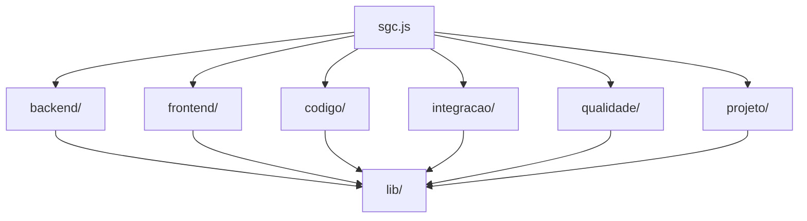

# Toolkit de Scripts do SGC

## Papel do módulo

`toolkit/` reúne a CLI de automação do repositório. Ela concentra comandos operacionais e de auditoria usados para
qualidade, preparação, diagnóstico do projeto e utilidades de backend/frontend.

### Execução e build

O toolkit executa a árvore-fonte diretamente. O build é uma verificação opcional do artefato compilado e não faz parte do
fluxo normal de desenvolvimento:

```bash
npm --prefix toolkit run build
```

Ponto de entrada principal:

```bash
npx tsx toolkit/sgc.js
```

Quando um comando importar módulos TypeScript, o toolkit usa `tsx` automaticamente. Também é possível executar um
script diretamente:

```bash
npx tsx toolkit/sgc.js --help
npx tsx toolkit/projeto/arvore-linhas.ts --help
```

## Visão arquitetural

O toolkit é um módulo Node.js em ESM, separado do backend/frontend, com dependências próprias e testes próprios.


```mermaid
graph TD
    CLI[sgc.js] --> Backend[backend/]
    CLI --> Frontend[frontend/]
    CLI --> Codigo[codigo/]
    CLI --> Integracao[integracao/]
    CLI --> Qualidade[qualidade/]
    CLI --> Projeto[projeto/]
    Backend --> Lib[lib/]
    Frontend --> Lib
    Codigo --> Lib
    Integracao --> Lib
    Qualidade --> Lib
    Projeto --> Lib
```

## Estrutura do diretório

| Caminho       | Papel                                                             |
|---------------|-------------------------------------------------------------------|
| `sgc.js`      | roteador principal da CLI                                         |
| `lib/`        | infraestrutura compartilhada, execução, caminhos, saída e utilidades |
| `backend/`    | comandos de cobertura, testes e higiene Java                      |
| `frontend/`   | comandos de cobertura, resíduos, validações e acessibilidade     |
| `codigo/`     | auditorias transversais de cheiros de código                       |
| `integracao/` | contratos OpenAPI e fronteira backend/frontend                    |
| `qualidade/`  | coleta e resumo de qualidade                                       |
| `projeto/`    | preparação, diagnóstico, limpeza e qualidade do repositório        |
| `test/`       | testes do toolkit                                                 |

## Comandos por domínio

### Backend

```bash
npx tsx toolkit/sgc.js backend cobertura auditoria
npx tsx toolkit/sgc.js backend testes analisar
npx tsx toolkit/sgc.js backend testes priorizar
npx tsx toolkit/sgc.js backend java corrigir-fqn
npx tsx toolkit/sgc.js backend notificacoes auditar-assuntos
```

### Frontend

```bash
npx tsx toolkit/sgc.js frontend cobertura auditoria
npx tsx toolkit/sgc.js frontend residuos auditar
npx tsx toolkit/sgc.js frontend residuos validar
npx tsx toolkit/sgc.js frontend identificadores-teste listar
npx tsx toolkit/sgc.js frontend identificadores-teste listar-duplicados
npx tsx toolkit/sgc.js frontend acessibilidade crawler
npx tsx toolkit/sgc.js frontend acessibilidade processar
```

### Código transversal

```bash
npx tsx toolkit/sgc.js codigo cheiros auditar
npx tsx toolkit/sgc.js codigo semgrep auditar
npx tsx toolkit/sgc.js codigo nomes coletar-simbolos
npx tsx toolkit/sgc.js codigo nomes auditar-consistencia
```

### Requisitos

```bash
npx tsx toolkit/sgc.js requisitos cdus inventariar
npx tsx toolkit/sgc.js requisitos cdus auditar
npx tsx toolkit/sgc.js requisitos cdus auditar-estilo
npx tsx toolkit/sgc.js requisitos cdus inventariar-vocabulario
npx tsx toolkit/sgc.js requisitos cdus auditar-vocabulario
npx tsx toolkit/sgc.js requisitos cdus inventariar-mensagens
npx tsx toolkit/sgc.js requisitos cdus auditar-mensagens
npx tsx toolkit/sgc.js requisitos cdus auditar-mensagens-codigo
npx tsx toolkit/sgc.js requisitos cdus inventariar-densidade
npx tsx toolkit/sgc.js requisitos cdus inventariar-duplicacoes
```

### Qualidade

```bash
npx tsx toolkit/sgc.js qualidade coletar --perfil rapido
npx tsx toolkit/sgc.js qualidade resumo
npx tsx toolkit/sgc.js qualidade resumo --limite-pontos-criticos 10
```

### Projeto

```bash
npx tsx toolkit/sgc.js projeto diagnostico
npx tsx toolkit/sgc.js projeto dependencias auditar
npx tsx toolkit/sgc.js projeto limpar --confirmar
npx tsx toolkit/sgc.js projeto qualidade rapido
npx tsx toolkit/sgc.js projeto preparar --instalar-dependencias
npx tsx toolkit/sgc.js projeto arvore-linhas
npx tsx toolkit/sgc.js projeto versao-sincronizar 1.2.3
```

## Casos de uso típicos

- gerar fotografia consolidada de qualidade para revisão técnica;
- auditar residuos e duplicidade no frontend;
- apoiar evolução da suíte de testes backend;
- validar divergência entre Bean Validation e validação de UI;
- preparar ambiente local de desenvolvimento;
- produzir artefatos de qualidade para inspeção manual.

Os artefatos gerados ficam em `toolkit/qualidade/artefatos/` e são organizados por execução e fotografia mais recente.

### Contrato OpenAPI

O Springdoc continua no backend porque o ciclo E2E usa a documentação OpenAPI/Swagger para aguardar a aplicação nos
ambientes `e2e` e `hom`. No toolkit, a integração mantém exportação, comparação e fixação de referência do contrato.
O gerador de tipos TypeScript foi removido enquanto não houver consumidor de tipos gerados no frontend e enquanto a
ferramenta de geração exigir uma versão anterior do TypeScript.

## Configuração e migração para TypeScript

Os diretórios variáveis do projeto podem ser sobrescritos em `configuracao-toolkit.json` na raiz. Os valores padrão
cobrem o layout atual do SGC, enquanto a configuração permite reutilizar o toolkit em outros projetos sem editar os
auditores.

O toolkit ainda executa JavaScript, mas já possui `tsconfig.json`, verificação de tipos e fronteiras de módulo estáveis.
A conversão para TypeScript deve começar pelas bibliotecas puras em `lib/` e `lib/dominios/`, seguida pelos comandos
que apenas adaptam CLI para domínio. Isso reduz o risco de converter simultaneamente roteamento, contratos de saída e
integrações externas.

Os comandos de requisitos/CDUs e de contratos OpenAPI são módulos importáveis: só executam quando chamados diretamente
pela CLI. Isso permite reutilizar suas funções `principal(argumentos)` em outras automações sem iniciar auditorias ou
integrações durante o carregamento.
`npm run typecheck:nucleo` verifica com `checkJs` os módulos compartilhados que formam a base da migração incremental.

Os comandos de projeto seguem a mesma fronteira. A árvore de linhas aceita `--base <diretorio>` para analisar outro
repositório Git, e a sincronização de versão aceita um diretório base nas funções reutilizáveis sem alterar o projeto
atual por padrão.

Na camada de qualidade, `coleta.js` e `resumo.js` têm fronteira reutilizável e não executam trabalho durante o `import`.
Já `coleta-execucao.js` permanece específico do SGC por coordenar Gradle, npm, Playwright e os auditores locais; ele não
deve ser promovido a abstração horizontal antes de existir um contrato de adaptadores para outro projeto.

Os comandos `codigo nomes` também resolvem `simbolos.json`, `consistencia.json` e `idioma.json` relativos ao `--base`
informado. Assim, a auditoria de outro projeto não lê nem grava silenciosamente no diretório de artefatos do SGC.

Os comandos `backend cobertura auditoria` e `backend cobertura ramificacoes` aceitam `--base` e `--arquivo` para
reutilizar relatórios JaCoCo de outro projeto Spring/Gradle. A antiga auditoria cruzada manual foi removida da CLI por
duplicar a leitura do XML sem contrato JSON ou testes próprios; o histórico Git preserva sua implementação.

## Dependências e execução

`toolkit/package.json` define dependências próprias, separadas do restante do repositório.

Instalação:

```bash
npm --prefix toolkit install
```

Execução dos testes do toolkit:

```bash
npm --prefix toolkit run test
```

Lint do toolkit:

```bash
npm --prefix toolkit run lint
```

Auditoria de dependências:

```bash
npm --prefix toolkit run deps:audit
npx tsx toolkit/sgc.js projeto dependencias auditar
```

## Organização dos testes

O diretório `test/` contém:

- `sgc.test.js`: testes da CLI principal
- `fixtures/`: dados auxiliares para simular cenários de execução

Esses testes garantem que a CLI continue roteando comandos, produzindo saídas e respeitando contratos básicos de
operação.

## Relação com o restante do repositório

O toolkit não substitui os comandos nativos de Gradle, npm ou Playwright; ele os complementa com:

- automação padronizada;
- relatórios agregados;
- auditorias específicas do SGC;
- comandos de produtividade difíceis de expressar apenas com scripts simples.

## Referências

- [README raiz](../../README.md)
- [Backend do SGC](../../backend/README.md)
- [Frontend do SGC](../../frontend/README.md)
