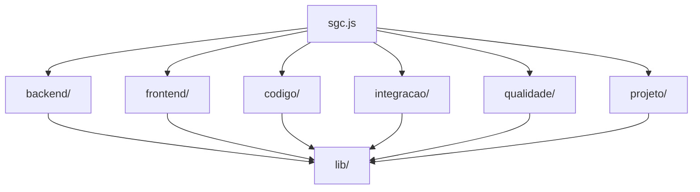

# Toolkit de Scripts do SGC

## Papel do módulo

`toolkit/` reúne a CLI de automação do repositório. Ela concentra comandos operacionais e de auditoria usados para
qualidade, preparação, diagnóstico do projeto e utilidades de backend/frontend.

Ponto de entrada principal:

```bash
node toolkit/sgc.js
```

## Visão arquitetural

O toolkit é um módulo Node.js em ESM, separado do backend/frontend, com dependências próprias e testes próprios.


```mermaid
graph TD
    CLI[sgc.js] --> Backend[backend/]
    CLI --> Frontend[frontend/]
    CLI --> Codigo[codigo/]
    CLI --> Integracao[integracao/]
    CLI --> Qualidade[qualidade/]
    CLI --> Projeto[projeto/]
    Backend --> Lib[lib/]
    Frontend --> Lib
    Codigo --> Lib
    Integracao --> Lib
    Qualidade --> Lib
    Projeto --> Lib
```

## Estrutura do diretório

| Caminho       | Papel                                                             |
|---------------|-------------------------------------------------------------------|
| `sgc.js`      | roteador principal da CLI                                         |
| `lib/`        | infraestrutura compartilhada, execução, caminhos, saída e utilidades |
| `backend/`    | comandos de cobertura, testes e higiene Java                      |
| `frontend/`   | comandos de cobertura, resíduos, validações e acessibilidade     |
| `codigo/`     | auditorias transversais de cheiros de código                       |
| `integracao/` | contratos OpenAPI e fronteira backend/frontend                    |
| `qualidade/`  | coleta e resumo de qualidade                                       |
| `projeto/`    | preparação, diagnóstico, limpeza e qualidade do repositório        |
| `test/`       | testes do toolkit                                                 |

## Comandos por domínio

### Backend

```bash
node toolkit/sgc.js backend cobertura auditoria
node toolkit/sgc.js backend cobertura cruzada
node toolkit/sgc.js backend testes analisar
node toolkit/sgc.js backend testes priorizar
node toolkit/sgc.js backend java corrigir-fqn
node toolkit/sgc.js backend notificacoes auditar-assuntos
```

### Frontend

```bash
node toolkit/sgc.js frontend cobertura auditoria
node toolkit/sgc.js frontend residuos auditar
node toolkit/sgc.js frontend residuos validar
node toolkit/sgc.js frontend identificadores-teste listar
node toolkit/sgc.js frontend identificadores-teste listar-duplicados
node toolkit/sgc.js frontend acessibilidade crawler
node toolkit/sgc.js frontend acessibilidade processar
```

### Código transversal

```bash
node toolkit/sgc.js codigo cheiros auditar
node toolkit/sgc.js codigo semgrep auditar
node toolkit/sgc.js codigo nomes coletar-simbolos
node toolkit/sgc.js codigo nomes auditar-consistencia
```

### Requisitos

```bash
node toolkit/sgc.js requisitos cdus inventariar
node toolkit/sgc.js requisitos cdus auditar
node toolkit/sgc.js requisitos cdus auditar-estilo
node toolkit/sgc.js requisitos cdus inventariar-vocabulario
node toolkit/sgc.js requisitos cdus auditar-vocabulario
node toolkit/sgc.js requisitos cdus inventariar-mensagens
node toolkit/sgc.js requisitos cdus auditar-mensagens
node toolkit/sgc.js requisitos cdus auditar-mensagens-codigo
node toolkit/sgc.js requisitos cdus inventariar-densidade
node toolkit/sgc.js requisitos cdus inventariar-duplicacoes
```

### Qualidade

```bash
node toolkit/sgc.js qualidade coletar --perfil rapido
node toolkit/sgc.js qualidade resumo
node toolkit/sgc.js qualidade resumo --limite-pontos-criticos 10
```

### Projeto

```bash
node toolkit/sgc.js projeto diagnostico
node toolkit/sgc.js projeto dependencias auditar
node toolkit/sgc.js projeto limpar --confirmar
node toolkit/sgc.js projeto qualidade rapido
node toolkit/sgc.js projeto preparar --instalar-dependencias
node toolkit/sgc.js projeto arvore-linhas
node toolkit/sgc.js projeto versao-sincronizar 1.2.3
```

## Casos de uso típicos

- gerar fotografia consolidada de qualidade para revisão técnica;
- auditar residuos e duplicidade no frontend;
- apoiar evolução da suíte de testes backend;
- validar divergência entre Bean Validation e validação de UI;
- preparar ambiente local de desenvolvimento;
- produzir artefatos de qualidade para inspeção manual.

Os artefatos gerados ficam em `toolkit/qualidade/artefatos/` e são organizados por execução e fotografia mais recente.

## Configuração e migração para TypeScript

Os diretórios variáveis do projeto podem ser sobrescritos em `configuracao-toolkit.json` na raiz. Os valores padrão
cobrem o layout atual do SGC, enquanto a configuração permite reutilizar o toolkit em outros projetos sem editar os
auditores.

O toolkit ainda executa JavaScript, mas já possui `tsconfig.json`, verificação de tipos e fronteiras de módulo estáveis.
A conversão para TypeScript deve começar pelas bibliotecas puras em `lib/` e `lib/dominios/`, seguida pelos comandos
que apenas adaptam CLI para domínio. Isso reduz o risco de converter simultaneamente roteamento, contratos de saída e
integrações externas.

## Dependências e execução

`toolkit/package.json` define dependências próprias, separadas do restante do repositório.

Instalação:

```bash
npm --prefix toolkit install
```

Execução dos testes do toolkit:

```bash
npm --prefix toolkit run test
```

Lint do toolkit:

```bash
npm --prefix toolkit run lint
```

Auditoria de dependências:

```bash
npm --prefix toolkit run deps:audit
node toolkit/sgc.js projeto dependencias auditar
```

## Organização dos testes

O diretório `test/` contém:

- `sgc.test.js`: testes da CLI principal
- `fixtures/`: dados auxiliares para simular cenários de execução

Esses testes garantem que a CLI continue roteando comandos, produzindo saídas e respeitando contratos básicos de
operação.

## Relação com o restante do repositório

O toolkit não substitui os comandos nativos de Gradle, npm ou Playwright; ele os complementa com:

- automação padronizada;
- relatórios agregados;
- auditorias específicas do SGC;
- comandos de produtividade difíceis de expressar apenas com scripts simples.

## Referências

- [README raiz](../../README.md)
- [Backend do SGC](../../backend/README.md)
- [Frontend do SGC](../../frontend/README.md)
